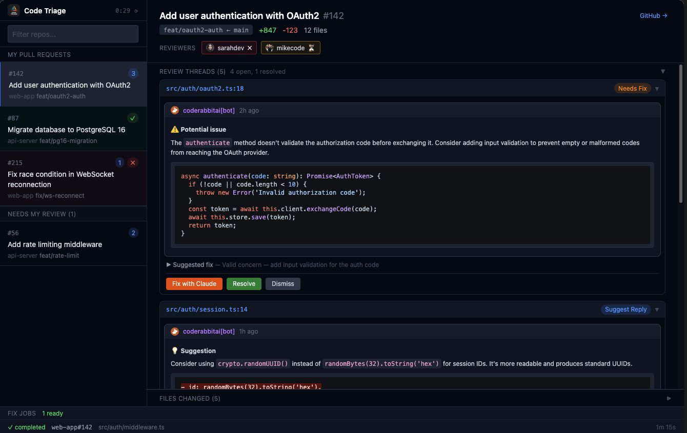

# Code Triage

A PR review dashboard that monitors your GitHub pull requests, analyzes review comments with Claude, and lets you act on them from a web UI.



## Quick Start

Install the [npm package](https://www.npmjs.com/package/code-triage) and run the `code-triage` CLI (or use `npx` without installing):

```bash
npm install -g code-triage
code-triage
```

Or, without a global install:

```bash
npx code-triage
```

Open http://localhost:3100 in your browser.

On first run you'll be prompted to configure your repos directory (default `~/src`).

### From source (contributors)

```bash
git clone git@github.com:lexwebb/code-triage.git
cd code-triage
yarn install
yarn build:all
yarn start
```

Use `yarn start` in place of `code-triage`; flags are passed after `--` (see [Usage](#usage)).

## Requirements

- Node.js 20+
- `gh` CLI (authenticated — run `gh auth login` first)
- `claude` CLI (for comment analysis and fixes)
- Git repos cloned locally under a common root directory

## Usage

```bash
code-triage                    # Start with WebUI on port 3100
code-triage --open             # Start and open browser
code-triage --config           # Re-run setup
code-triage --port 8080        # Custom port
code-triage --root ~/code      # Custom repos directory
code-triage --repo owner/r     # Single repo mode
code-triage --dry-run          # Skip Claude analysis
code-triage --status           # Show state and exit
code-triage --cleanup          # Remove all worktrees
```

When developing from a clone, use `yarn start --` before each flag, for example `yarn start -- --open`.

## Development

```bash
# Run everything (tsc watch + CLI with auto-restart + Vite HMR)
yarn dev

# Open http://localhost:5173 (proxies API to :3100)
```

## CLI Hotkeys

| Key | Action |
|-----|--------|
| `r` | Refresh (poll now) |
| `o` | Open WebUI in browser |
| `d` | Re-discover repos |
| `s` | Show status |
| `p` | List PRs |
| `c` | Clear state |
| `q` | Quit |

## Features

- **Multi-repo discovery** — scans a root directory for all GitHub repos
- **Comment analysis** — Claude evaluates each review comment and suggests an action
- **WebUI dashboard** — review threads, file diffs, syntax highlighting, markdown rendering
- **Action buttons** — send replies, resolve threads, dismiss comments from the UI
- **Fix with Claude** — Claude applies code fixes in isolated git worktrees, preview diff before pushing
- **PR review** — approve or request changes on PRs you're reviewing
- **Reviewer status** — see who has approved, requested changes, or is pending
- **Web notifications** — get alerted when PRs need attention or fixes complete
- **URL routing** — shareable URLs for specific PRs and files
- **Repo filtering** — filter sidebar by repo name or PR title

## How It Works

1. Discovers GitHub repos under your configured root directory
2. Polls for open PRs assigned to you and PRs requesting your review
3. For each new review comment, Claude analyzes whether it needs a reply, fix, or can be resolved
4. Results are displayed in the WebUI with action buttons
5. You decide — send the suggested reply, apply a fix with Claude, resolve, or dismiss

## Config & State

- Config: `~/.code-triage/config.json`
- State: `~/.code-triage/state.json`
- Worktrees: `.cr-worktrees/` in each repo root
