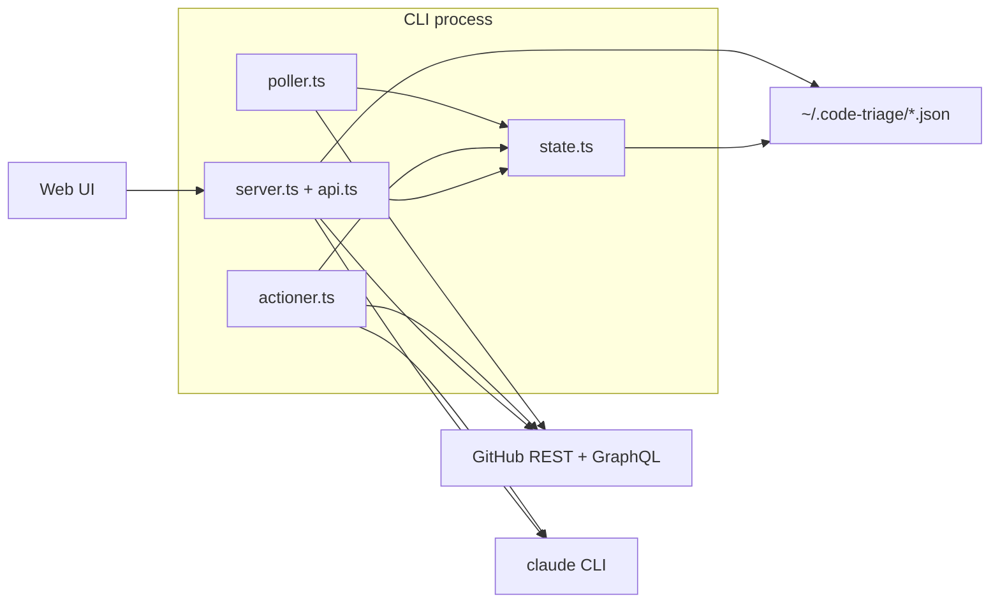

# Architecture

Code Triage is a **single Node.js process** that (1) polls GitHub for new review comments on **your** open PRs, (2) runs **Claude** to classify each comment, (3) persists results to disk, and (4) serves a **static React SPA** plus a small **JSON HTTP API** so you can review threads, trigger replies, and run automated fixes.

## High-level diagram

## Runtime components

### Entry and lifecycle (`src/cli.ts`)

- Parses flags, verifies `gh` and `claude`, runs first-time **setup** when needed (`src/config.ts`).
- Discovers repos (`src/discovery.ts`) or uses `--repo` for a single logical repo.
- Starts the HTTP server, runs an **initial poll**, then schedules periodic polls on a timer.
- Uses an **Ink** terminal UI (`src/terminal.tsx`) for status, countdown to next poll, and hotkeys (refresh, open browser, rediscover, clear state, quit).
- On shutdown, clears timers, kills tracked child processes from Claude runs, and exits.

### Polling pipeline (`src/poller.ts`)

1. Lists **open pull requests** for the repo.
2. Keeps only PRs where the **authenticated user is the author** (`pr.user.login === username`).
3. For each such PR, loads **review comments** (line comments on the diff) and, in parallel, GraphQL data for **resolved threads**.
4. Filters comments: not from ignored bots, not already in local state, not belonging to a resolved thread.
5. Returns new comments plus a map of PR metadata for notifications and analysis.

**Important:** This pipeline drives **Claude evaluation** and desktop notifications. PRs where you are only a **requested reviewer** (someone else’s PR) are **not** polled here; they appear in the web UI via a separate API (see below).

### Analysis (`src/actioner.ts`)

- For each new comment, invokes `claude -p` with a structured prompt asking for JSON: `reply`, `fix`, or `resolve`, plus summary and optional reply text.
- Parses JSON robustly (direct parse, extraction from markdown, then heuristic fallback).
- Updates `state.json` with `pending` status and attaches the `evaluation` object.
- Exposes helpers used by the API: **post reply**, **resolve review thread** (GraphQL), **apply fix** in a worktree (`claude -p --dangerously-skip-permissions`).
- Spawns Claude with `detached: true` and tracks PIDs so shutdown can send **SIGTERM** to process groups.

### HTTP server (`src/server.ts`, `src/api.ts`)

- Plain `http.createServer` — no framework.
- **Route table**: method + path patterns with `:params` and `*path` splats; POST bodies parsed once into `req.__body`.
- **Static files**: in production, serves `web/dist` with SPA fallback to `index.html` for client-side routes.
- **CORS**: permissive (`*`) for local development and simple tooling.
- **Poll status**: in-memory `pollState` plus fix-job status map; merged into `GET /api/poll-status` with rate-limit hints from `exec.ts`.

### GitHub access (`src/exec.ts`)

- **REST** and **GraphQL** use `fetch` with a bearer token from `gh auth token` (cached), not subprocess `gh api` — fewer process spawns and easier pagination (follows `Link: rel="next"` for array endpoints).
- Optional **per-repo token** when `config.accounts` is set (owner/org matched to pick PAT vs default `gh` token).
- Retries on **429** with backoff using `X-RateLimit-Reset`.

### Repo discovery (`src/discovery.ts`)

- Walks a configurable root up to depth **3**, skips common junk dirs and hidden directories.
- When a `.git` directory is found, reads `origin` and accepts only **github.com** remotes.
- Produces `RepoInfo { repo, localPath }` used for API allowlisting and **git worktrees** (fixes need `localPath`).

### Notifications (`src/notifier.ts`)

- On new comments from the poller, fires a **macOS** notification via `osascript` and logs a formatted summary to the terminal.
- The **browser** can show separate notifications (see `web/src/useNotifications.ts`) when the UI detects poll completion or fix-job completion via `GET /api/poll-status`.

## Web frontend (`web/`)

- **Vite + React 19 + TypeScript + Tailwind v4**.
- **Router** (`web/src/router.ts`): path shape `/:owner/:repo/pull/:number?file=...` for shareable deep links; state synced with `history.pushState`.
- **Data**: fetches JSON from same origin (production) or dev proxy to port 3100; caches PR lists in **sessionStorage** for fast first paint.
- **Polling**: periodically hits `/api/poll-status` for backend poll progress, fix jobs, and optional test-notification flag.

## Demo mode (`src/demo.ts`, `cli.ts --demo`)

- Serves stub data without GitHub or Claude — useful for UI development and screenshots.

## Dependency boundaries

| Concern | Location |
|--------|----------|
| GitHub I/O | `exec.ts`, `poller.ts`, `api.ts`, parts of `actioner.ts` |
| Claude I/O | `actioner.ts` only |
| Persistence | `state.ts`, `config.ts` |
| Worktrees | `worktree.ts` |
| HTTP routing | `server.ts`, `api.ts` |

## Build artifacts

- CLI compiles to `dist/` (ESM).
- Web builds to `web/dist/`, bundled into the npm package for the embedded server.
